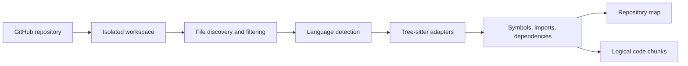

# Architecture

## Design goals

Reponyx separates orchestration from capabilities so that each operation can be tested without an LLM or a live repository. The application will use ports and adapters only where they protect a real boundary: providers, persistence, GitHub, filesystem workspaces, and command execution.

## Planned components

| Component | Responsibility | First phase |
| --- | --- | --- |
| API | Request validation, authentication boundary, run status responses | 0 |
| Application services | Use-case coordination and domain state transitions | 3 |
| Agent orchestration | Explicit LangGraph read-only state machine and stop conditions | 3 |
| LLM providers | OpenAI and Ollama chat model adapters | 3 |
| Embedding providers | Pluggable embedding adapters | 2 |
| Code intelligence | Language detection, Tree-sitter parsing, symbols and dependencies | 1 |
| Retrieval | Hybrid lexical/semantic search, reranking, context assembly | 2 |
| Workspace manager | Temporary repository workspaces and lifecycle cleanup | 1 |
| Execution gateway | Validated commands and test execution | 4 |
| Repair service | Ephemeral workspace, validated patches, bounded repair loop | 5 |
| LLM repair intelligence | Structured provider abstraction, bounded context, patch/failure schemas | 6 |
| Sandbox adapter | Docker isolation and resource policy enforcement | 4 |
| GitHub adapter | Read operations first; writes only after explicit approval | 8 |
| Persistence | PostgreSQL metadata, vectors, and index status | 1-2 |
| Vector store | PostgreSQL-compatible vector records with application similarity | 2 |
| Evaluation | Benchmark definitions, runner, metrics, reports | 2 |
| Web dashboard | Next.js presentation and run observability | 9 |

## Data flow

1. A client submits a repository reference and issue to the API.
2. A run service creates a durable run record and an isolated workspace.
3. Ingestion maps files, symbols, references, and chunks without executing repository code.
4. Retrieval combines lexical and semantic candidates, applies metadata filters, reranks when configured, and records source attribution.
5. The investigation graph gathers evidence and emits structured summaries rather than private chain-of-thought.
6. Controlled tools run only through an execution gateway. The gateway applies command, path, timeout, output, and resource policies.
7. The fixing graph writes minimal changes, inspects diffs, runs targeted tests, and iterates up to a configured limit.
8. The run report records evidence, commands, test results, changes, metrics, and final status.

## Repository structure

```text
src/reponyx/
  api/                 HTTP routes and dependency wiring
  application/         use cases and ports
  domain/              stable domain models and policies
  infrastructure/      provider, persistence, GitHub, and process adapters
  main.py              application entry point
tests/
  unit/
  integration/
docs/
scripts/
```

Phase 1 adds repository intake, workspace management, SQLAlchemy metadata persistence, file discovery, Tree-sitter adapters, static dependency extraction, repository maps, and logical code chunks. Phase 2 adds provider-neutral embeddings, repository-scoped vector records, lexical search, semantic search, hybrid ranking, controlled query rewriting, optional reranking, context assembly, source attribution, and retrieval evaluation. It does not add code execution or agent orchestration.

The default score is `0.65 * normalized semantic score + 0.35 * lexical score`. Weights are configurable globally and per request. This is a transparent starting point, not a claim of optimality. Indexing batches normalized logical chunks and replaces a repository's vectors after a successful pass. Every search applies the repository predicate before optional metadata filters.

Phase 7's 20-query deterministic retrieval evaluation measured lexical Recall@5 `0.45`, Precision@5 `0.21`, MRR `0.542`; semantic Recall@5 `1.00`, Precision@5 `0.42`, MRR `0.663`; and hybrid Recall@5 `1.00`, Precision@5 `0.44`, MRR `0.738`.

Phase 3 adds an explicit LangGraph sequence: `create_plan -> retrieve_context -> inspect_sources -> inspect_dependencies -> collect_evidence -> generate_hypotheses -> verify_hypotheses -> build_report`. The state stores concise plans, source-attributed retrieval results, bounded source inspections, evidence, hypotheses, verification status, confidence, and the final report. The graph has no command or write node and uses a configured recursion limit.

Phase 7 enriches the Phase 5 repair state with structured root-cause, repair-plan, failure-analysis, repair-decision, and retrieval-evidence fields. Hard system limits remain outside model control.

Confidence is evidence-based: high requires multiple supported independent evidence items, medium requires relevant support with remaining uncertainty, and low means evidence is absent or incomplete. The deterministic model and tests never convert an unverified hypothesis into a confirmed root cause.

## Phase 6 LLM architecture

Phase 6 preserves the Phase 5 `RepairModel` protocol. The default mock provider supports deterministic offline tests; `OpenAIStructuredProvider` is opt-in and uses the existing API-key configuration. Provider calls are bounded by timeout, output token, and per-repair call limits. The context builder combines issue text, evidence references, retrieval sources, and bounded test history while explicitly treating all repository text as untrusted data.

Structured operations include repair patch proposals, with schemas reserved for repair plans, root-cause analyses, failure analyses, and repair decisions. Invalid structured output fails safely before patch validation. The existing patch validator remains authoritative and no model output can change command policy, execution limits, workspace boundaries, or security configuration.

## Phase 4 execution architecture

Phase 4 introduces a separate execution gateway. API and investigation code submit only registered test framework identifiers. The gateway maps those identifiers to structured argv, validates resource policy, copies the canonical repository workspace into a unique ephemeral directory, and invokes Docker without a shell. The copy is mounted read-only. Containers use a dedicated image, no network by default, dropped capabilities, no-new-privileges, CPU/memory/PID limits, timeout cleanup, and bounded stdout/stderr.

Approved initial commands are:

```text
python -m pytest -q
npm test
go test ./...
cargo test
```

Shell strings, chaining, substitution, redirection, absolute paths, traversal, Docker, Git writes, privilege escalation, and network tools are rejected. Execution results are normalized into test summaries and bounded execution evidence. Phase 4 does not provide source modification or a generic `run_command` tool.

## Phase 1 analysis flow



Source files stay in the workspace. PostgreSQL stores the repository URL, workspace path, status, timestamps, and serialized analysis metadata. Phase 2 adds repository-scoped indexed chunk content, embeddings, and index status in separate retrieval tables; application-side similarity keeps SQLite tests portable until pgvector provisioning is evaluated.

## Configuration strategy

`pydantic-settings` loads environment variables with a `REPONYX_` prefix. Settings are immutable after construction and are injected into the application factory. Provider credentials, database URLs, execution limits, and feature flags belong in configuration, never source code.

## Testing strategy

- Unit tests cover pure policies, parsers, adapters, and configuration.
- Integration tests cover API contracts and real infrastructure adapters when available.
- Property tests cover parsers, path restrictions, and command validation where boundary combinations matter.
- Evaluation tests use fixed benchmark fixtures and machine-readable metrics.
- Security tests attempt traversal, symlink, secret exposure, network, resource, and cleanup violations.

## Deferred architectural decisions

- PostgreSQL with pgvector versus PostgreSQL plus Qdrant will be selected after Phase 1 ingestion needs are measured.
- Background job infrastructure will be selected when run duration and concurrency requirements are known.
- Authentication and authorization model will be selected before externally exposing the API.
