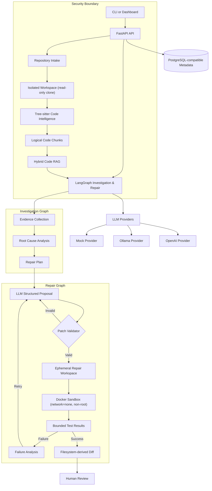

# Reponyx

## AI Software Engineering Agent

Analyze. Diagnose. Repair. Verify.

> An AI software engineering agent that analyzes repositories, retrieves relevant code, diagnoses bugs, generates validated patches, executes tests inside an isolated Docker sandbox, and produces evidence-backed repair reports.

Reponyx is not a generic chatbot. It is a controlled software-engineering system built around repository intelligence, source-attributed retrieval, structured investigation, ephemeral repair workspaces, Docker test execution, bounded iteration, and human review.

## Engineering Highlights

| Capability | Implementation |
| --- | --- |
| **Agentic workflow** | LangGraph state machine for investigation and repair with explicit stop conditions |
| **Code intelligence** | Tree-sitter parsing across 6 languages with symbol, import, export, and dependency extraction |
| **RAG retrieval** | Hybrid lexical + semantic search with query rewriting, reranking, and source attribution |
| **LLM structured outputs** | Provider-neutral abstraction with bounded context, token limits, and call budgets |
| **Patch validation** | Path traversal protection, symlink rejection, size limits, and hash verification before application |
| **Secure execution** | Docker-only sandbox with `--network none`, non-root user, no shell, no Docker socket |
| **Resource limits** | CPU, memory, PID, timeout, and output truncation with enforced cleanup |
| **Failure analysis** | Structured root-cause analysis, repair planning, and bounded revision loops |
| **Human review** | Pending-review, approve, reject, and cancel states with evidence-backed reports |
| **Evaluation infrastructure** | Deterministic retrieval and repair benchmarks with machine-readable metrics |

## Capabilities

### Repository Intelligence

- Safe HTTPS GitHub intake and shallow cloning
- Isolated repository workspaces
- Tree-sitter parsing for **Python, JavaScript, TypeScript, Java, Go, and Rust** (6 languages)
- Functions, classes, methods, interfaces, types, imports, exports, decorators, and source locations
- Static dependency relationships
- Repository maps with languages, package managers, entry points, tests, and configuration files
- Logical symbol-based code chunks

### Codebase RAG

- Deterministic, OpenAI, and Ollama embedding providers
- Repository-scoped vector indexing
- Code-aware lexical search
- Semantic search with configurable weights
- Hybrid ranking (default: 65% semantic, 35% lexical)
- Query rewriting with deterministic fallback
- Metadata filters by language, file path, and symbol type
- Optional reranking
- Deduplication and character-budgeted context assembly
- Exact file, symbol, line-range, and chunk attribution

### Read-only Investigation

- Explicit LangGraph investigation workflow
- Retrieval, source inspection, symbol lookup, and static dependency tools
- Structured evidence and hypotheses
- Supported, contradicted, and inconclusive verification states
- Evidence-based confidence levels (high / medium / low)
- Root-cause investigation reports

### Controlled Repair

- Ephemeral repair workspaces (canonical repository never modified)
- Structured patch proposals from LLM providers
- Path, symlink, hash, file-count, line-count, and size validation
- Filesystem-derived unified diffs
- Bounded repair iterations (configurable max)
- Failure-driven repair state with structured root-cause, plan, and failure analysis
- Human-review artifact before approval

### Secure Test Execution

- Explicit test-command allowlist (pytest, npm test, go test, cargo test)
- No arbitrary shell endpoint
- Docker-only repository execution with dedicated non-root image
- Read-only repository mount
- No Docker socket
- Network disabled by default (`--network none`)
- CPU, memory, PID, timeout, and output limits
- Container and ephemeral-workspace cleanup on every exit path
- Structured test results and execution evidence

### Operational Maturity

- Mock, Ollama, and OpenAI provider modes
- Ollama health diagnostics with connection and model availability checks
- Bounded in-process repair jobs
- Repair history API
- Pending-review, approve, reject, and cancel states
- Lightweight operations dashboard at `dashboard/index.html`

## Architecture



## End-to-End Flow

```mermaid
flowchart LR
    Issue[Issue] --> Retrieve[RAG Retrieval]
    Retrieve --> Investigate[Investigation]
    Investigate --> RCA[Root Cause]
    RCA --> Plan[Repair Plan]
    Plan --> LLM[LLM Patch Proposal]
    LLM --> Validate[Validate]
    Validate --> Apply[Apply in Ephemeral Workspace]
    Apply --> Execute[Docker Tests]
    Execute --> Analyze[Failure Analysis]
    Analyze --> Iterate{Pass?}
    Iterate -->|No| LLM
    Iterate -->|Yes| Final[Diff + Evidence Report]
    Final --> Human[Human Review]
```



## Measured Results

All measurements are deterministic fixture-scale benchmarks, not general performance claims.

### Retrieval Evaluation

20 deterministic fixture queries, measured at `k=5`:

| Method | Recall@5 | Precision@5 | MRR |
| --- | ---: | ---: | ---: |
| Lexical | 0.450 | 0.210 | 0.542 |
| Semantic | 1.000 | 0.420 | 0.663 |
| Hybrid | **1.000** | **0.440** | **0.738** |

### Repair Evaluation

Deterministic repair benchmark (mock provider, 1 case):

| Metric | Result |
| --- | ---: |
| Patch application success | 1.00 |
| Repair success | 1.00 |
| Iterations to fix | 1 |

### Verification

```text
77 total tests (67 passed, 10 Docker integration skipped)
Ruff: clean
Ruff format: clean
Mypy: clean
```

### What Is Not Measured

- Real OpenAI provider benchmark (no API key configured)
- Real Ollama provider benchmark (Ollama unavailable in verification environment)
- Production-scale workload performance
- Multi-file or cross-module repair scenarios

## Security Model

The trust model is intentionally strict:

```text
LLM proposes
  -> system validates paths, sizes, and hashes
  -> changes apply only in ephemeral workspace
  -> Docker executes approved tests (network=none, non-root)
  -> filesystem produces the diff
  -> tests provide evidence
  -> human reviews
```

### Security Properties

| Property | Status |
| --- | --- |
| Canonical repository immutability | Verified - never modified by repair |
| Ephemeral repair workspace | Verified - unique copy per repair, cleaned after completion |
| Docker isolation | Verified - non-root (UID 65532), no shell in final image |
| Network isolation | Verified - `--network none` by default |
| No Docker socket | Verified - not mounted |
| No credential pass-through | Verified - sentinel secrets absent from containers |
| CPU / memory / PID limits | Verified - enforced and cleaned up |
| Timeout handling | Verified - returns `timed_out`, removes container and workspace |
| Output limits | Verified - bounded stdout/stderr, `output_truncated=true` |
| Symlink protection | Verified - no workspace escape |
| Host-file isolation | Verified - host sentinel files unreachable |
| Patch path validation | Verified - traversal, symlink, size, and hash checks |
| Changed-file limits | Verified - max files, lines, deletions, and total size |
| Prompt-injection defenses | Verified - all repo text treated as untrusted data |
| Human review boundary | Verified - no approval without explicit endpoint |

See [SECURITY.md](SECURITY.md) for the complete security model and Docker verification details.

## Local Setup

Requirements:

- Python 3.12+
- Docker Desktop with Linux containers (for sandbox integration)
- PostgreSQL (for Docker development stack) or SQLite (for tests)
- Optional: Ollama (for local LLM repair)

### Quick Start

```powershell
python -m venv .venv
.\.venv\Scripts\Activate.ps1
python -m pip install -e ".[dev]"
Copy-Item .env.example .env
python -m uvicorn reponyx.main:app --reload
```

### Verify

```powershell
Invoke-RestMethod http://127.0.0.1:8000/healthz
```

### Docker Development Stack

```powershell
docker compose up --build
```

### Frontend (Next.js)

```powershell
cd frontend
npm install
npm run dev
```

The frontend runs at `http://localhost:3000` and connects to the backend at `http://127.0.0.1:8000`.

Configure the backend URL:

```powershell
$env:NEXT_PUBLIC_API_URL="http://127.0.0.1:8000"
```

### Local LLM With Ollama

```powershell
ollama serve
ollama pull qwen2.5-coder:7b
$env:REPONYX_LLM_PROVIDER="ollama"
$env:REPONYX_LLM_MODEL="qwen2.5-coder:7b"
$env:REPONYX_OLLAMA_BASE_URL="http://localhost:11434"
python -m uvicorn reponyx.main:app --reload
```

Check provider availability:

```powershell
Invoke-RestMethod http://127.0.0.1:8000/llm/health
```

## Development

### Tests

```powershell
python -m pytest                        # Unit tests (no Docker required)
python -m pytest tests/integration -m integration  # Docker integration tests
```

### Quality

```powershell
python -m ruff check .
python -m ruff format --check .
python -m mypy src
```

### Benchmarks

```powershell
python scripts/run_repair_benchmark.py              # Deterministic repair
python scripts/run_phase7_retrieval_evaluation.py   # 20-query retrieval
```

### Build Execution Image

```powershell
docker build -f execution.Dockerfile -t reponyx-executor:phase4 .
```

## Quick Demo

Try Reponyx with the [demo-buggy-calculator](https://github.com/najaraasif/demo-buggy-calculator) — a Python module with 5 intentional bugs.

```bash
# Start services
docker compose up -d
cd frontend && npm install && npm run dev &
cd .. && uvicorn reponyx.main:app --reload

# Add the demo repo
curl -X POST http://127.0.0.1:8000/repositories \
  -H "Content-Type: application/json" \
  -d '{"url": "https://github.com/najaraasif/demo-buggy-calculator.git"}'

# Analyze it
curl -X POST http://127.0.0.1:8000/repositories/{ID}/analyze \
  -H "Content-Type: application/json" -d '{"deep": true}'

# Investigate and repair
curl -X POST http://127.0.0.1:8000/repositories/{ID}/repairs \
  -H "Content-Type: application/json" \
  -d '{"issue": "average uses integer division instead of true division"}'

# Review the diff
curl http://127.0.0.1:8000/repairs/{REPAIR_ID}/diff
```

### What happens under the hood

```
Issue: "average uses integer division"
    ↓
Repository Analysis (Tree-sitter parsing, symbol extraction)
    ↓
Hybrid Retrieval (lexical + semantic search across codebase)
    ↓
Investigation (evidence collection, root cause hypothesis)
    ↓
Repair Planning (deterministic model matches keyword rule)
    ↓
Patch Application (file-level replacement with diff generation)
    ↓
Docker Sandbox Execution (isolated, network-disabled, resource-bounded)
    ↓
Test Verification (pytest exits 0 = success)
    ↓
Repair Report (changed files, diff, verification level)
    ↓
Human Review (approve / reject via UI or API)
```

### Architecture

```
┌─────────────┐     ┌──────────────┐     ┌─────────────────┐
│  Frontend    │────▶│  FastAPI      │────▶│  Repository     │
│  (Next.js)  │     │  Backend      │     │  Intake         │
└─────────────┘     └──────────────┘     └────────┬────────┘
                                                   │
                    ┌──────────────────────────────┘
                    ▼
          ┌──────────────────┐     ┌──────────────────┐
          │  Tree-sitter      │────▶│  Hybrid RAG       │
          │  Code Intelligence│     │  Retrieval        │
          └──────────────────┘     └────────┬─────────┘
                                            │
                    ┌───────────────────────┘
                    ▼
          ┌──────────────────┐     ┌──────────────────┐
          │  Investigation    │────▶│  Repair           │
          │  (LangGraph)      │     │  (LangGraph)      │
          └──────────────────┘     └────────┬─────────┘
                                            │
                    ┌───────────────────────┘
                    ▼
          ┌──────────────────┐     ┌──────────────────┐
          │  Docker Sandbox   │────▶│  Repair Report    │
          │  (Test Execution) │     │  + Human Review   │
          └──────────────────┘     └──────────────────┘
```

## Limitations

- The deterministic repair benchmark currently has one fixture case
- Real Ollama and OpenAI benchmarks were not executed (no credentials available)
- The dashboard is a lightweight static operations view, not a full frontend application
- Background jobs are bounded in-process jobs, not a distributed queue
- Authentication and role-based authorization are not fully implemented
- Full token/cost metrics are unavailable when providers do not expose usage metadata
- The retrieval/vector implementation is application-side for SQLite portability
- No Git operations, pull requests, merges, deployment, or automatic approval exist

## Project Documentation

- [ARCHITECTURE.md](ARCHITECTURE.md) - Component responsibilities and data flow
- [SECURITY.md](SECURITY.md) - Trust boundaries and Docker verification
- [CONTRIBUTING.md](CONTRIBUTING.md) - Development setup and change rules
- [CHANGELOG.md](CHANGELOG.md) - Phase-by-phase development history
- [docs/DEMO.md](docs/DEMO.md) - Portfolio demo capture guide

## License

License selection is intentionally deferred until project ownership and distribution requirements are defined.
