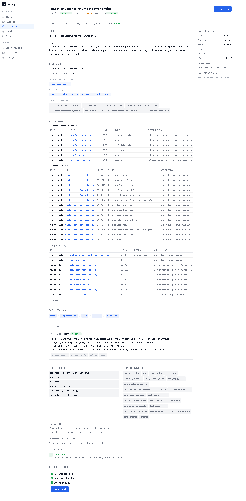
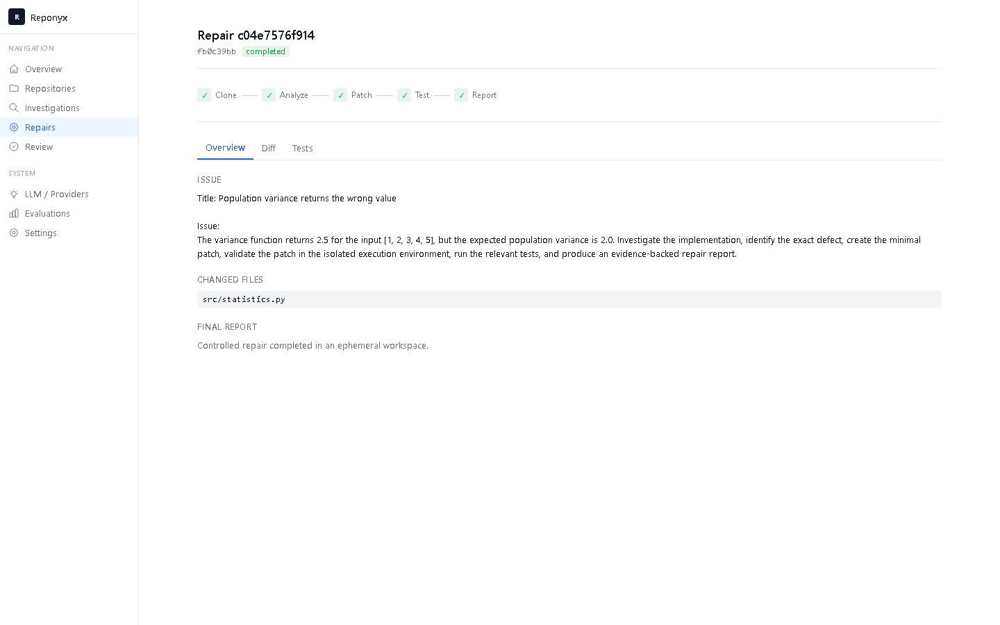
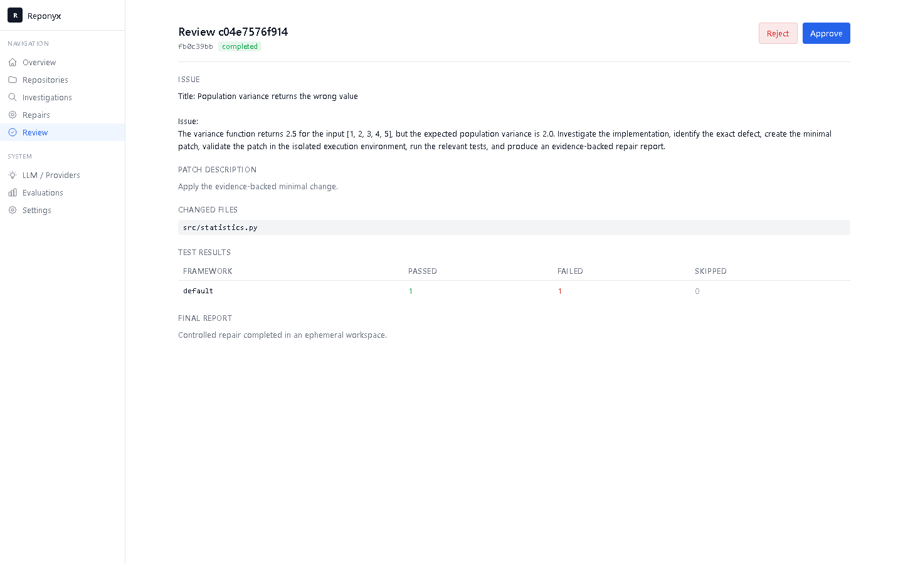

# Reponyx

### AI Software Engineering Agent

Investigate repository issues. Find the evidence. Identify the root cause. Generate a minimal repair. Run the tests in isolation. Review the result.

[](https://www.python.org/)
[](https://fastapi.tiangolo.com/)
[](https://nextjs.org/)
[](https://www.docker.com/)
[](https://www.postgresql.org/)
[](#license)

[Demo Repository](https://github.com/najaraasif/demo-buggy-calculator) · [Architecture](ARCHITECTURE.md) · [Security](SECURITY.md) · [Contributing](CONTRIBUTING.md)

---

## Overview

Reponyx is an AI software engineering agent I built to work through repository issues in a controlled way.

Instead of sending a problem straight to an LLM and trusting the response, Reponyx first builds an understanding of the repository, retrieves relevant source evidence, investigates the issue, proposes a repair, validates the patch, runs tests in an isolated environment, and produces a report for human review.

The main idea is simple:

> **The model can propose the change. The system should verify it.**

That principle drives most of the architecture.

---

## How It Works

A typical repair follows this flow:

```text
Issue
  ↓
Repository Intake
  ↓
Code Intelligence
  ↓
RAG / Source Retrieval
  ↓
Investigation
  ↓
Root Cause
  ↓
Repair Plan
  ↓
Patch Generation
  ↓
Patch Validation
  ↓
Docker Test Execution
  ↓
Failure Analysis / Iteration
  ↓
Repair Report
  ↓
Human Review
```

The canonical repository is never modified during the repair process. Changes are made in an isolated workspace and tested before the resulting diff is presented for review.

---

## Engineering Highlights

| Area | Implementation |
|---|---|
| **Agent workflow** | LangGraph state machine with explicit investigation, repair, validation, and stop conditions |
| **Code intelligence** | Tree-sitter parsing across Python, JavaScript, TypeScript, Java, Go, and Rust |
| **Repository RAG** | Hybrid lexical + semantic retrieval with query rewriting, reranking, metadata filters, and source attribution |
| **LLM integration** | Provider-neutral abstraction with bounded context, token limits, and call budgets |
| **Patch validation** | Path traversal protection, symlink rejection, file and size limits, and hash verification |
| **Test execution** | Docker-only sandbox with network disabled, non-root execution, and resource limits |
| **Review workflow** | Pending, approve, reject, and cancel states with evidence-backed reports |

---

## Repository Intelligence

Reponyx starts by understanding the repository before attempting a repair.

It can:

- Clone GitHub repositories safely over HTTPS
- Perform shallow repository intake
- Detect languages and project structure
- Parse source code with Tree-sitter
- Extract functions, classes, methods, imports, exports, interfaces, types, decorators, and source locations
- Build repository maps
- Identify package managers, entry points, tests, and configuration files
- Create logical symbol-based code chunks

Supported languages:

**Python · JavaScript · TypeScript · Java · Go · Rust**

---

## Codebase RAG

The retrieval layer is designed specifically for source code.

It supports:

- Repository-scoped vector indexing
- Deterministic, OpenAI, and Ollama embedding providers
- Code-aware lexical search
- Semantic search
- Hybrid ranking
- Query rewriting with deterministic fallback
- Metadata filtering by language, path, and symbol type
- Exact file and symbol attribution
- Line-range and chunk attribution

The goal is not just to retrieve similar text. It is to give the investigation workflow source evidence that can be traced back to the repository.

---

## Investigation

The investigation workflow uses LangGraph to keep the process structured.

It can:

1. Retrieve relevant code
2. Inspect source evidence
3. Look up symbols
4. Trace static dependencies
5. Build hypotheses
6. Verify those hypotheses against repository evidence
7. Identify the most likely root cause
8. Produce an investigation report

Evidence is tracked as supported, contradicted, or inconclusive rather than treating every model statement as fact.

---

## Repair

Once a root cause has enough evidence, Reponyx creates a repair proposal.

The repair system supports:

- Deterministic repair rules for known issue patterns
- LLM-based repair proposals
- Ephemeral repair workspaces
- Path and symlink validation
- File count and size limits
- Hash validation
- Structured repair plans
- Filesystem-derived unified diffs
- Bounded repair iterations
- Failure-driven repair analysis

The original repository is not edited directly.

---

## Docker Test Sandbox

Tests are executed inside an isolated Docker environment.

The execution layer uses:

- Non-root execution
- No Docker socket
- Network disabled with `--network none`
- Read-only repository mounts
- CPU limits
- Memory limits
- PID limits
- Execution timeouts
- Output truncation
- Explicit test-command allowlists
- Cleanup on every exit path

Supported test commands include:

```text
pytest
npm test
go test
cargo test
```

This creates a clear boundary between an AI-generated change and the environment used to verify it.

---

## Security Model

The core security flow is:

```text
LLM proposes
    ↓
System validates paths, sizes, and hashes
    ↓
Patch applies only in an ephemeral workspace
    ↓
Docker runs approved tests
    ↓
Filesystem produces the final diff
    ↓
Tests provide verification evidence
    ↓
Human reviews the result
```

| Property | Status |
|---|---|
| Canonical repository never modified | Verified |
| Ephemeral repair workspace | Verified |
| Docker non-root execution | Verified |
| Network disabled by default | Verified |
| No Docker socket | Verified |
| CPU / memory / PID limits | Verified |
| Patch traversal and symlink checks | Verified |
| Human review before approval | Verified |

See [SECURITY.md](SECURITY.md) for the full security model.

---

## Demo

The easiest way to try the system is with the [demo-buggy-calculator](https://github.com/najaraasif/demo-buggy-calculator) repository.

It contains intentional Python bugs that can be used to walk through the investigation and repair workflow.

### Start the services

```bash
docker compose up -d

cd frontend
npm install
npm run dev
```

In another terminal:

```bash
uvicorn reponyx.main:app --reload
```

### Add the demo repository

```bash
curl -X POST http://127.0.0.1:8000/repositories \
  -H "Content-Type: application/json" \
  -d '{"url": "https://github.com/najaraasif/demo-buggy-calculator.git"}'
```

### Analyze it

```bash
curl -X POST http://127.0.0.1:8000/repositories/{ID}/analyze \
  -H "Content-Type: application/json" \
  -d '{"deep": true}'
```

### Start an investigation and repair

```bash
curl -X POST http://127.0.0.1:8000/repositories/{ID}/repairs \
  -H "Content-Type: application/json" \
  -d '{"issue": "average uses integer division instead of true division"}'
```

### Review the resulting diff

```bash
curl http://127.0.0.1:8000/repairs/{REPAIR_ID}/diff
```

---

## Architecture

```text
┌──────────────┐
│   Next.js    │
│   Frontend   │
└──────┬───────┘
       │
       ▼
┌──────────────┐
│   FastAPI    │
│   Backend    │
└──────┬───────┘
       │
       ▼
┌──────────────────────┐
│ Repository Intake    │
└──────────┬───────────┘
           │
           ▼
┌──────────────────────┐
│ Tree-sitter          │
│ Code Intelligence    │
└──────────┬───────────┘
           │
           ▼
┌──────────────────────┐
│ Hybrid RAG           │
│ Retrieval            │
└──────────┬───────────┘
           │
           ▼
┌──────────────────────┐
│ LangGraph            │
│ Investigation/Repair │
└──────────┬───────────┘
           │
           ▼
┌──────────────────────┐
│ Docker Sandbox       │
│ Test Execution       │
└──────────┬───────────┘
           │
           ▼
┌──────────────────────┐
│ Repair Report        │
│ + Human Review       │
└──────────────────────┘
```

---

## Screenshots

### Investigation

Evidence collection and root-cause analysis for the demo calculator repository.



### Repair

Generated patch, changed files, and Docker test verification.



### Review

Completed repair with verification status and human review controls.



---

## Setup

Requirements:

- Python 3.12+
- Docker Desktop
- PostgreSQL for the full application
- SQLite can be used for tests

### Backend

```bash
git clone https://github.com/najaraasif/reponyx.git
cd reponyx

python -m venv .venv
source .venv/bin/activate

# Windows:
# .venv\Scripts\activate

pip install -e ".[dev]"
cp .env.example .env

uvicorn reponyx.main:app --reload
```

### Frontend

```bash
cd frontend
npm install
npm run dev
```

### Docker execution image

```bash
docker build -f execution.Dockerfile -t reponyx-executor:phase4 .
```

### Health check

```bash
curl http://127.0.0.1:8000/healthz
```

---

## Tests

```bash
python -m pytest
python -m ruff check .
python -m ruff format --check .
```

Current repository status:

- **108 unit tests passing**
- **Ruff lint clean**
- **Ruff format clean**

The tests are designed to verify the system without requiring Docker for the unit-test suite.

---

## Project Documentation

- [ARCHITECTURE.md](ARCHITECTURE.md) — system architecture and component responsibilities
- [SECURITY.md](SECURITY.md) — security model and trust boundaries
- [CONTRIBUTING.md](CONTRIBUTING.md) — development setup and contribution rules
- [CHANGELOG.md](CHANGELOG.md) — project history
- [docs/DEMO.md](docs/DEMO.md) — demo and portfolio capture guide

---

## Current Limitations

Reponyx is still an active engineering project.

Some current limitations are:

- Repair workspaces are temporary after a repair completes, while the resulting diff is persisted.
- Deterministic repair rules cover a limited set of known issue patterns.
- LLM-based repair is the broader path for arbitrary repository issues.
- A repair currently targets one repository at a time.
- Reponyx does not create pull requests, merge changes, deploy applications, or approve repairs automatically.
- Authentication and role-based authorization are not currently implemented.

These are deliberate boundaries for the current project rather than claims that the system solves every part of software delivery.

---

## Why I Built It

I wanted to explore what happens when an AI coding agent is treated more like an engineering system than a chat interface.

The interesting part for me is not just getting a model to generate code. It is everything around that generation:

- finding the right repository context
- separating evidence from guesses
- keeping repairs isolated
- validating changes before execution
- running tests safely
- handling failures
- producing something a developer can actually review

That is the problem Reponyx is built around.

---

## License

MIT
